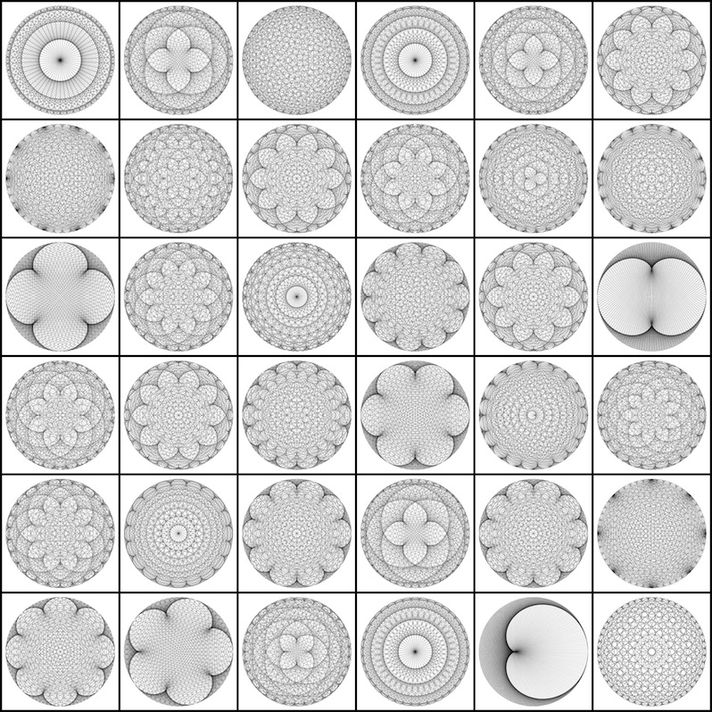

# Strange-Curves
Patrones generados matemáticamente. El código está escrito en Processing. Pueden descargar [processing en este link](https://processing.org/).

Un excelente explicación de como se generan esas curcvas la pueden encontrar en este [video](https://www.youtube.com/watch?v=qhbuKbxJsk8&t=360s).

# Algunos patrones

